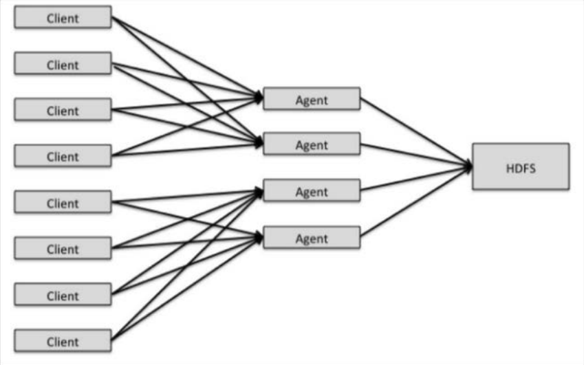
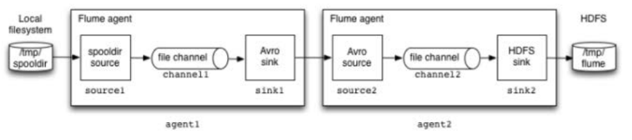
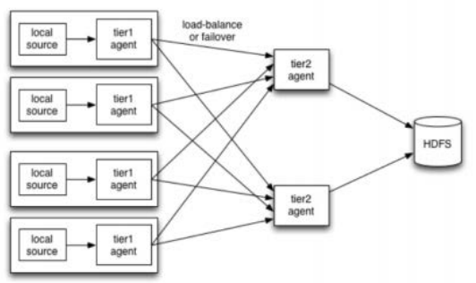
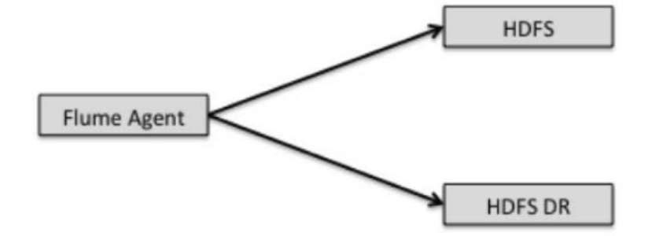
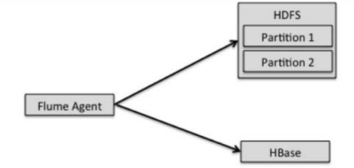

## __*HDFS*__

### Pagina oficial 
     http://hadoop.apache.org/docs/current/hadoop-project-dist/hadoop-common/FileSystemShell.html#appendToFile

### Informacion sobre un comando en especifico
     hdfs dfs -help command

#### Subir ficheros a hdfs 
    hadoop/hdfs dfs -copyFromLocal carpetalocal /carpetaHDFS

#### Listar las carpetas dentro de hdfs 
    hadoop/hdfs dfs -ls / 

#### Eliminar carpetas 
    hadoop/hdfs dfs -rm -r carpetaHDFS
    
### Ejecutar jar de ejemplo 
    hadoop jar hadoop-mapreduce-examples-2.7.2.jar wordcount /input /output
    
### Mostrar contenido 
    hdfs dfs -cat hdfs/file

### Compilae clase con las dependencias de hadoop y lanzar el Job con el Jar 
    javac Class.java -cp `hadoop classpath`
    jar -cvf wc.jar Class*.class
    hadoop jar wc.jar MainClass /input /output
    
### Ejecutar Job escrito en python 
     hadoop jar $HADOOP_HOME/share/hadoop/tools/lib/hadoop-*streaming*.jar 
     -file $(pwd)/mapper.py  
     -mapper mapper.py 
     -file $(pwd)/reducer.py  
     -reducer reducer.py 
     -input /input/* 
     -output /output
     
### Problemas DataNode
   Si los DataNode (Slave) no son ejecutados al arrancar hdfs, se deben eliminar los ficheros current en la carpeta datanode 
   que se encuentra en la ruta definida para hdfs, En este caso: 
   ```
    rm -r /home/bigdata/hadoop_store/hdfs/datanode/current 
   ```
   Y luego ejecutar el siguiente comando:
   ```
    hadoop namenode -format
   ```
   Luego se debe ejecutar el start de hdfs para que incluya los nuevos nodos slave al cluster. ESTE COMANDO SE EJECUTA EN EL NODO MASTER:
   ```
    cd $HADOOP_HOME && ./sbin/start-dfs.sh 
   ``` 
   O ESTOOO
   ```
    cd $HADOOP_HOME && ./sbin/hadoop-daemon.sh start datanode
   ```

### Agregar mas contenido a un fechero ya existente
     hdfs dfs -appendToFile index.html /index.html

### Mostrar contenido de un fichero 
     hdfs dfs -cat /xd.txt
     hdfs dfs -cat /xd.txt | head 
     hdfs dfs -cat /xd.txt | tail 
         
### Listar ficheros incluyendo subdirectorios
     hdfs dfs -ls -R / 

### Traer dicheros desde hdfs a la maquina
     hdfs dfs -get /file.txt file.txt

### Copiar ficheros del servidor local a hdfs
     hdfs dfs -put file.txt /directory/
     
### Copiar ficheros en directorios dentro de hdfs
     hdfs dfs -cp /file.txt /directory

### Mostrar el tamaño de ficheros y directorios 
     hdfs dfs -du / 

### Sumar el tamaño de ficheros y directorios 
     hdfs dfs -du -s /
     hdfs dfs -dus /  

### Buscar ficheros 
     hdfs dfs -find / -name regex
     
### Mover ficheros de la maquina local a HDFS.
   Es similar a put pero el fichero se elimina de la maquina local 
   ```
    hdfs dfs -moveFromLocal |  -moveToLocal index.txt /index.txt
   ``` 

### Contar la cantidad de ficheros o carpetas dentro de un path 
     hdfs dfs -count /path 

### Crear ficheros dentro de hdfs 
     hdfs dfs -touchz /path/file.py

### Fusionar dos ficheros y traerlos al sistema de ficheros local 
     hdfs dfs -getmerge -nl /pathFilesOrDirectoryHDFS pathlocal
     
## __*PIG*__ 
     Pig se creo para crear jobs MapReduce 

### Ejecutar Pig con Hadoop O Local
     pig -x local 
     pig -x mapreduce 

```
Todos los comando de hdfs funcionan en grunt 
```

### Tipos de datos Pig latin
    
     int 
     long 
     float
     double
     chararray
     bytearray
     boolean
     datetime
     biginteger
     bigdecimal
     tuple -> (19,2)
     bag -> An collection of tuples. {(19,2), (18,1)}
     map -> A set of key value pairs.
    
### Crear un *Esquema* apartir de un fichero delimitado por comas.
     disk = load 'pathfile.(txt,scv,etc)' using PigStorage(',') as (field1,field2)
     disk = LOAD 'mydata' AS (T1:tuple(f1:int, f2:int), B:bag{T2:tuple(t1:float,t2:float)}, M:map[] ); 
     
### Informacion/Propiedades sobre el esquema creada 
     #disk se creo en la anterior linea
     describe disk 

### HEAD del contenido dentro del esquema  
     illustrate disk 

### Mostrar los registros dentro de un esquema 
     dump disk 

### Operadores aritméticos
     +
     -
     *
     /
     %
     ?:
     case when then else end
### Operadores comparación
    ==
    !=
    <
    >
    <=
    >=
    matches
### Operadores booleanos
     AND
     OR
     IN
     NOT
### Operadores sobre Nulos
     is null
     is not null

### Operadores relacionales
    ❖ CROSS: realiza el producto cartesiano de dos o más relaciones.
    ❖ DISTINCT:elimina tuplas duplicadas de una relación.
    ❖ FILTER: selecciona tuplas de una relación basadas en una condición.
    ❖ FOREACH: genera transformaciones de datos en base a los datos de las columnas.
    ❖ GROUP: agrupa los datos en una o más relaciones
    ❖ JOIN (inner): realiza inner join de dos o más relaciones basadas en los valores de campos comunes.
    ❖ JOIN (outer): realiza outer join de dos o más relaciones basadas en los valores de campos comunes.
    ❖ LIMIT: limita el resultado de salida de las tuplas.
    ❖ LOAD: carga datos desde el sistema de archivos.
    ❖ ORDER: ordena la relación en base a uno o más campos.
    ❖ SAMPLE: particiona una relación en dos o más relaciones.
    ❖ SPLIT: divide una relación en dos o más relaciones.
    ❖ STORE: almacena o guarda los resultados al sistema de archivos.
    ❖ STREAM: envía datos a un script o programa externo
    ❖ UNION: calcula la relación de dos o más relaciones

### Crear un esquema apartir de otro con Filter 
     new_schema = filter disk by year >= 2000

### Agrupar un esquema apartir de una condicion 
     new_schema = group disk by uk
     b = group a by (from, to);

### Join entre esquemas 
     result = join data1 by c1, data2 by c1;

### Limitar la cantidad de registros a retornar 
     y= limit discos 3;

### Order By 
     orders= order discos by year desc;
     
### Devolver un tanto porciento de un fichero 
     samples = sample discos 0.1 (10%)
     
### Dividir el esquema de mini esquemas dadas ciertas condiciones
     split discos into x if year<=1970,y if year>1970 and year<2000,z if year>2000;

### Unir dos esquemas
     un= union a,b; 

## HIVE 

*tip:se pueden ejecutar comandos de hdfs dentro de la consola de hive.*

### Crear tabla 
     create table if not exist nametable(nameField dataType...);

### Insertar registros 
     insert into nametable values (...);
 
### Contar la cantidad de registros 
     select count(*) from nametable;     

### Limitar la cantidad de datos en un select 
     select * from nametable limit 12...

### Ejecutar comandos desde afuera del shell de hive
     hive -e "select ..."

### Ejecutar un fichero con scripts
     hive -f querys.sql

### Cargar datos de un fichero en una tabla 
     load data local inpath '/path/to/file.txt' into table nametable;
   
     
##Sqoop

### Importar datos de una db     
    sqoop import --connect jdbc:mysql://mysql/sqoop --username root --password root --table users

### Exportar
    
    sqoop export
     --connect jdbc:mysql://mysql/sqoop
     --table users \
     --export-dir /results/users_data
     
     sqoop export 
     --connect jdbc:mysql://mysql/sqoop 
     --table users 
     --username root 
     --password root  
     --export-dir /results/users_data


## Spark 
    https://blog.usejournal.com/spark-study-notes-core-concepts-visualized-5256c44e4090
    
### RDD
    Resilient distributed dataset.
    
    spark-shell -> Scala
    pyspark     -> Python
    
    Todo sobre un rdd es lazy hasta que se ejecuta una accion.
    Existen dos conceptos para trababajar con RDD's: 
    Transformaciones: 
        map
        flatMap
        filter
        sortBy
        ...
    Acciones: 
        count
        reduce
        foreach
        collect
        take
        reduceByKey
        first
        ... 

#### Scala    
##### Leer fichero en hdfs a partir de spark context (sc)
    // scala
    val lines = sc.textFile("hdfs://localhost:9000/spark/file.txt")
    // python
    textFile = sc.textFile("/spark/file.txt")
    
##### Aplicar transformaciones y acciones
    lines 
        map(_.trim)
        filter(_.length>0)
        map(_.split(" "))
        map(_.length)
        filter(_>1)
        foreach(print _) // accion
    
    textFile
        .map(lambda x: x*2)
        .filter(lambda x: x%2==0)
        .count()
    

##### Crear un RDD a partir de un array 
    val rdd = sc.parallelize(Array(1,2,3,4,5,6)).map(_*2)
    list = sc.parallelize([1,2,3,4,5,6]).map(lambda x: x*2).filter(lambda x: x%2==0).collect()
    

## Spark SQL 

##### Crear una tabla y realizar consultas sobre ella 
    import org.apache.spark.sql.Row;
    import org.apache.spark.sql.types.{StructType,StructField,StringType};
    
    val sqlContext = spark.sqlContext
    val people = sc.textFile("hdfs://localhost:9000/people.txt")
    
    val schemaString = "nombre edad"
    val schema = StructType(schemaString.split(" ").map(fieldName => StructField(fieldName, StringType, true)))
    
    val rowRDD = people.map(_.split(",")).map(p => Row(p(0), p(1).trim))
    val peopledf = sqlContext.createDataFrame(rowRDD, schema)
    peopledf.createOrReplaceTempView("people")
    
    peopledf.show()
    sqlContext.sql("SELECT nombre, edad FROM people").show()
    
    peopledf.printSchema()
    
    peopledf.select("nombre").show()
    sqlContext.sql("select nombre from people").show()
    
    peopledf.select($"nombre", $"edad" * 2).show()
    sqlContext.sql("select nombre,(edad * 2) from people").show()
    
    peopledf.filter($"edad" > 22).show()
    sqlContext.sql("select * from people where edad > 22").show()
    
    peopledf.groupBy("edad").count().show()
    sqlContext.sql("select edad,count(edad) from people group by edad order by edad desc").show()
    
## Spark Streaming
#### iniciar el demonio master y slave 
    ./sbin/start-master.sh && ./sbin/start-slave.sh
    
#### ejecutar ejemplos incluidos en spark con spark-submit  
    nc -lvp 9999 &&   
    $SPARK_HOME/bin/spark-submit \
     --class org.apache.spark.examples.streaming.NetworkWordCount \
     --master "local[2]" \
     ./examples/jars/spark-examples_2.12-3.0.0-preview2.jar \
     localhost 9999
     
## FLUME
    La arquitectura de flume se divide en: 
    
    source(fuente) 
        consumen eventos de cualquier sistema 
        externo y lo reenvian a los canales (channels)
    
    Interceptors
        permiten hacer modificaciones sobre los eventos recibidos
       
    Selectors
        permite definir rutas para los eventos 
        
    Channels
        almacenan los eventos hasta que son consumidos por un sink
        Sistema de almacenamiento temporal.
        
    Sink
        Obtienen eventos de un canal. por ejemplo HDFS 
    
#### Source 
    
    Flume incorpora varias fuentes ya implementadas:
    
        ○ Avro: Escucha eventos en un puerto enviados via Avro RPC
        ○ Thrift: Escucha eventos en un puerto enviados via Thrift RPC
        ○ Exec: Ejecuta un comando Unix y convierte la salida stdout en eventos
        ○ JMS: Lee mensajes de una cola ó tópico JMS y los convierte en
            eventos
        ○ Spooling Directory: Lee los ficheros que se escriben en una ruta y
            convierte las líneas en eventos
        ○ Twitter: Integración con Streaming API de Twitter
        ○ NetCat: Escucha en un puerto y convierte cada línea de texto en un
            evento
        ○ Sequence Generator: Generador de eventos para pruebas
        ○ Syslog: Convierte eventos syslog en eventos Flume
        ○ HTTP: Escucha en un puerto y convierte peticiones HTTP en eventos
    
Se deben tener en cuenta dos factores importantes al momento de 
configurar un Source: 
        
    ○ Batch Size(registros o tiempo): numero maximo de eventos recibidos en el source por transaccion.
                  Tiene mucha importancia a nivel de rendimiento. 
                  Recomendación: empezar con batch size = 1000 y luego ajustar.
    
    ○ Threads: Cada fuente utiliza un modelo distinto de “Threading”.
               Es importante conocer cómo maneja los Threads la fuente que
               estamos intentando optimizar.
               Por ejemplo:
                    ○ Avro Source es un servidor Netty, capaz de manejar varios
                      hilos de por sí. Para añadir paralelismo símplemente
                      necesitamos más “Avro Clients” enviando datos.
                    ○ JMS Source es una fuente de tipo “pull”, con un único hilo
                      consumiendo de una cola de mensajes. Para añadir
                      paralelismo necesitamos añadir más fuentes JMS a Flume
                      consumiendo de la misma cola 

#### Sinks 
    
    Son los encargados de persistir los datos en su destino final
    
    Algunos de los que vienen ya implementados en Flume:
        ○ HDFS: Escribe eventos en HDFS en formato Text,
            SequenceFile, Avro ó un formato propio
        ○ Logger: Escribe eventos en un log con nivel INFO usando
            SLF4J
        ○ Avro: Envía eventos via Avro RPC a un Avro Source
        ○ Thrift: Envía eventos via Thrift RPC a un Thrifs Source
        ○ IRC: Envía eventos a un canal IRC
        ○ File Roll: Escribe eventos en el file-system local
        ○ Hbase: Escribe eventos en HBase
        ○ Solr: Indexa documentos en Solr
        ○ ElasticSearch: Indexa documentos en Elasticsearch con el
            formato de Logstash
    
Se deben tener en cuenta dos factores importantes al momento de configurar un Sink:
    
    ○ Número de Sinks
    ○ Tamaño de Batch
    
    ● Un sink sólo puede consumir eventos de un channel
    ● Muchos sinks pueden consumir eventos de un mismo channel
    ● Un sink es siempre un único hilo
    ● Para poder paralelizar, aumentamos el número de sinks
        consumiendo del mismo channel
    ● Por ejemplo: un solo sink escribiendo en HDFS sólo podrá
    alcanzar como máximo el rendimiento de escritura de un solo
    disco. Si aumentamos el número de sinks, aumentaremos la
    cantidad de datos que podemos escribir por unidad de tiempo.
    ● En este caso la limitación será la red ó la CPU, pero no HDFS
    ● Siempre que hablamos de operaciones con discos, trabajar con
    batches incrementa el rendimiento
    ● Un sink de flume debe garantizar al channel que los datos han sido
    persistidos en destino, lo que implica que se debe invocar la
    operación de systema fsync (que es costosa)
    ● Si estamos usando batches de poco tamaño, se perderá mucho
    tiempo invocando estas llamadas de sistema
    ● El único problema de batches más grandes es el mayor riesgo de
    eventos duplicados en caso de fallos.
    ● Tendremos que llegar a un compromiso entre rendimiento y riesgo
    de duplicar eventos.
    
    
#### Channels 
Sistema de almacenamiento temporal que conecta al source con el sink. 
    
    ● Son los repositorios donde los eventos son temporalmente almacenados en un agente.
    ● Las fuentes añaden eventos y los “sinks” los eliminan
    ● Los más utilizados son:
        ○ Memory Channel: Almacena eventos en una cola en
            memoria de eventos
        ○ File Channel: Almacena eventos en un log transaccional en
            un fichero local
        ○ JDBC Channel: Almacena eventos en una base de datos
            (Derby)
    
Memory Channel
    
    ● Se utiliza cuando la prioridad es el rendimiento y la pérdida de
        datos es asumible
    ● Si la máquina que aloja el memory channel cae, o se
        interrumpe el proceso Java que lo aloja, todos los eventos de
        ese channel se perderán (ya que estaban en memoria)
    ● El número de eventos que se pueden almacenar está limitado
        por la cantidad de memoria RAM, por lo que si hay fallos en
        siguientes agentes, no podrá almacenar muchos eventos antes
        de empezar a perder datos.
    
File Channel
    
    ● Persiste los eventos en disco, por lo que es más confiable que
        el canal en memoria y menos eficiente
    ● También escribe periódicamente “checkpoints”, que facilitan el
        reinicio y recuperación de los File Channels
    ● Se puede configurar para utilizar varios discos y obtener así
        mayor rendimiento
    
#### Patrones comunes 
    
    ● Fan-in (Agregación)
        ○ El patrón de recolección más común o Un agente Flume en
            cada sistema origen (p. ej. Servidores web), que envían
            eventos a agentes Flume en nodos cliente del cluster Hadoop
            (que están en la misma red que el cluster).
        ○ Utilizar múltiples nodos clientes de HDFS aporta robustez a la
            arquitectura: si uno de ellos deja de dar servicio, no se
            perderán eventos
        ○ Normalmente se envían los eventos comprimidos para
            reducir el tráfico de red
        ○ Flume soporta tráfico encriptado SSL entre los agentes
   
   
   
       ● Esta estructura de capas de agentes Flume es la forma estándar de
            escalar una arquitectura de recolección
       ● La segunda capa de agentes, agrega eventos de varias fuentes, y los
            persiste en un único fichero HDFS
       ● Esto permite tener menos ficheros más grandes en HDFS
       ● Normalmente con 2 capas de agentes Flume podremos conseguir la
            escalabilidad deseada, pero se podrían definir más si el número de
            orígenes es muy grande.
       ● Para construir este tipo de topologías se utilizan sinks y sources de
            tipo Avro ó Thrift. En ambos casos la comunicación entre agentes es
            via RPC (Esto no significa necesariamente que el formato de fichero
            en HDFS será AVRO)
       ● Mediante Transacciones, Flume garantiza que un batch de eventos se
            entrega correctamente desde un source a un channel y desde un
            channel a un sink.
       ● En una topología de varias capas de agentes, Flume garantiza que
            cada batch de eventos de un agente de la primera capa, es
            correctamente entregado a un agente de la segunda capa

   
    
    ● Podemos definir “sink groups” en los agentes de la primera capa,
        para aportar más robustez a la topología y balancear la carga
    ● Si uno de los agentes del segundo nivel cae, los eventos serán
        entregados a otro agente de ese nivel y evitaremos pérdida de datos
    
   
    
#### Fan Out (dividir los datos en la recolección)

    ○ Enviar eventos a más de un destino
    ○ Muy utilizado cuando se tiene un segundo cluster Hadoop
        para “Disaster Recovery”
    ○ Un cluster hadoop de “Disaster Recovery” es un cluster
        secundario pensado para dar servicio si el cluster primario
        cae.
    ○ También sirve para hacer backup de los datos del cluster
        primario (forma habitual de hacer backup en Hadoop)
    
   
        
    ● Particionar los datos en el destino
        ○ Flume se puede utilizar para particionar los datos según
            los va persistiendo en destino
        ○ Ejemplo: El HDFS sink puede particionar datos por
            fecha, etc
            
   
       
    ● “Stream Analytics”
        ○ A veces no se utiliza una capa de persistencia como destino
            de los datos de Flume
        ○ Otro caso común es enviarlo a un motor de procesamiento
            en streaming como Storm o Spark Streaming
        ○ Por ejemplo, la integración con Spark Streaming es sencilla
            por que éste implementa la interfaz de Fuente Avro de
            Flume, por lo que lo único que haremos es apuntar un
            sumidero Flume de Avro a Spark Streaming
        ○ En este caso probablemente querremos utilizar Memory
            Channels
    
## FLINK
  iniciar cluster de flink
  
    start-cluster.sh

    
    